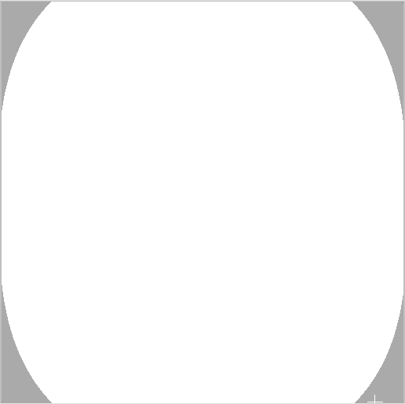

# ShaderPixel
Learn to create shaders for complex object rendering... or just to make cool things

# Fractals
You can try various shaders by using glslViewer.

## Julia set

```bash
glslViewer frag/fractal/julia.frag
```



## Mandelbrot

```bash
glslViewer frag/fractal/mandelbrot.frag
```


## Mandelbox

```bash
glslViewer frag/fractal/mandelbox.frag
```


<br></br>

# Mandelbox on 3D environment
You can see Mandelbox floating above the sea.

```
cd srcs
make
./shaderPixel
```


<br></br>

## References
- [The Book of Shaders](https://thebookofshaders.com/)
