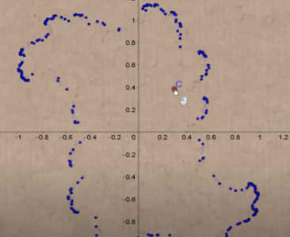
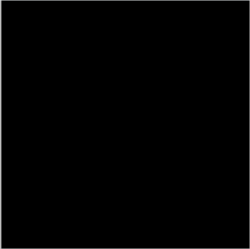
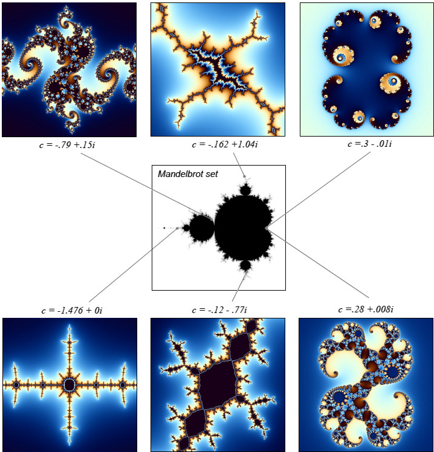

# Various shaders

You can try various shaders by using glslViewer.

```bash
glslViewer *.frag
```

<br></br>

# Julia set
Julia set is a type of fractal. It is represented as a complex number $z=x+yi$. $z$ is updated by the following equation.

$$
z=z^2+c
$$

$c$ is a constant. $c$ can be added to produce various boundaries instead of circles.



You can draw Julia set by running the following command.

```bash
glslViewer fractal/julia.frag
```

**Pattern1: $c=0.274+0.008i$**


**Pattern2: $c=0.285+0.01i$**


**Pattern3: $c=-0.70176-0.3842i$**



<br></br>

## Mandelbrot set
In Mandelbrot, the value of $c$ is determined by the coordinates. $z$ is initialized at $(0,0)$ and updated according to the formula $z=z^2+c$. Mandelbrot includes various Julia sets depending on the coordinates.



You can draw Mandelbrot set by running the following command.

```bash
glslViewer fractal/mandelbort.frag
```


<br></br>

# References
- [The Book of Shaders](https://thebookofshaders.com/)
- [Exploring The Mandelbrot And Julia Sets](https://storymaps.com/stories/37478f4f41874a30b97074d945b67bef)
- [Understanding Julia and Mandelbrot Sets](https://www.karlsims.com/julia.html)
